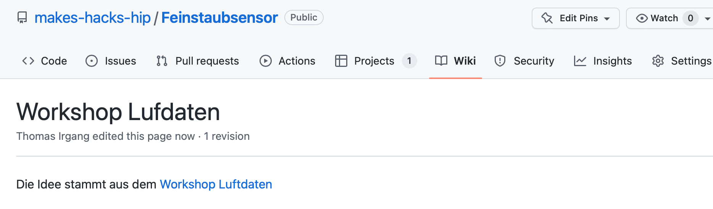

# Github Guide

Wir verwenden Github um unsere Projekte zu planen und zu dokumentieren.

## Was ist Git?

Git ist ein verteiltes Versionierungssystem und hat in der IT Industrie CVS und SVN abgelöst. Git wurde von Linux Torvalds entwickelt, um die Linux Kernel Entwicklung zu erleichtern,  und ist Ideal um  verteilt mit mehreren Personen am selben Projekt zu arbeiten.

Eine kurze Einführung in Git findest du hier: [Git Lernen in 30 Minuten - Anfänger Tutorial (2022)](https://lerneprogrammieren.de/git/)

## Wie kann ich mit Github arbeiten?

Zunächst brauchst du einen Github Acount. Diesen kannst du dir [hier](https://gothub.com) anlegen.

Um auf deinem Rechner mit den Dateien in den Repositories zu arbeiten brauchst du einen git Client. Eine einfache Möglichkeit ist die [Github Desktop App](https://desktop.github.com).

Eine Einführung in Github Desktop findest du hier: [GitHub Desktop Tutorial - Arbeiten Sie mit GitHub von Ihrem Desktop aus zusammen - Andere](https://ger.myservername.com/github-desktop-tutorial-collaborate-with-github-from-your-desktop)

## Wie kann ich and er Projekt Dokumentation mitarbeiten?

Wir schreiben unsere Projekt-Dokumentation in Markdown. Markdown Dateien sind reine Text-Dokumente in denen Überschriften usw. mit Hilfe einer einfachen Konvention mit normalen Zeichen "markiert" werden.

Einen Überblick über Markdown findest du hier:  [markdown.de | Markdown Syntax-Dokumentation](https://markdown.de/)

Um Dokumentation auf deinem Rechner zu bearbeiten empfehlen wir [Zettlr](https://www.zettlr.com). Zettlr ist ein moderner, freier Markdown Editor den du auf deinem Rechner installieren kannst.

Einen Überblick über Zettlr findest du hier: [Schnellstart - Zettlr Docs](https://docs.zettlr.com/de/5-minutes/)

Aus den Markdown-Dateien generieren wir eine statische Webseite zur Projekt-Dokumentation die mit Github Pages gehostet wird. Die Generierung der Seite übernimmt Mkdocs und du must dafür nichts machen, da das eine Github Action übernimmt.

Mehr Informationen zu Mkdocs findest du hier: [User Guide - MkDocs](https://www.mkdocs.org/user-guide/)

## Wie verwenden wir Github?

Wir verwenden Github vor allem zur Planung von Projekten mit "Projects" und zur Dokumentation der Projekte.

### Zugriffsrechte

Für die Zugriffsrechte benutzen wir Teams.
Es gibt ein Team für alle aktiven Makerspace Mitglieder: [makerspace-hip](https://github.com/orgs/makes-hacks-hip/teams/makerspace-hip)

Für jede Projekt-Gruppe gibt es ein Sub-Team. Wir haben z.B. ein Team [lotstation](https://github.com/orgs/makes-hacks-hip/teams/lotstation), für alle die an der Make Lötstation arbeiten und ein Team [feinstaub-sensor](https://github.com/orgs/makes-hacks-hip/teams/feinstaub-sensor) für unser LoRaWan Feinstaubsensor-Projekt.

Pull-requests und andere Beiträge sind von allen willkommen, unabhängig davon ob jemand "aktives Mitglied" ist oder nicht!

Wir sind eine Projekt-Gruppe des Repair-Café Hilpoltstein, und offen für jeden, ohne Mitgliedsbeitrag. Falls du Interesse hast mitzumachen findest du unsere Termine auf der [Seite des Repair-Café](https://www.repaircafe-hilpoltstein.de). 

### Projektplanung mit Github

Zur Projektplanung verwenden wir Github Projects.

Für jedes Projekt gibt es ein Kanban-Board um die Ziele zu planen.

 
Weiter gibt es für jedes Projekt ein "Dokumentations-Repository", in dem die Projekt Dokumente abgelegt werden und das Projekt mit Hilfe des statischen Seitengenerators Mkdocs dokumentiert wird.
Die Dokumentation in Form von [Markdown](https://www.markdownguide.org/basic-syntax/) Dokumenten befindet sich im Unterordner "docs".
Die Dokumentation von Mkdocs findest du [hier](https://www.mkdocs.org/user-guide/writing-your-docs/). 

 
Wir haben für jedes Dokumentations-Repository eine Github Action die automatisch die generierte Dokumentation aktualisiert.

## Informationssammlung für Projekte

Die Diskussion zu neuen Projekten findet in der Regel im [Forum des Repaircafé](https://forum.makes-hacks-hip.de) statt.

Um schnell, und relativ unstrukturiert Informationen zu Projekten zu sammeln verwenden wir das im Dokumentations-Repository integrierte Wiki.
 

Für die strukturierte Dokumentation verwenden wir [Mkdocs](https://www.mkdocs.org). Die Markdown-Dokumente liegen im Repository im Unterordner "docs".

## Probleme mit Projekten
Zur Dokumentation und Bearbeitung von Problemen mit der bisherigen Projektumsetzung verwenden wir Github Issues.
 
